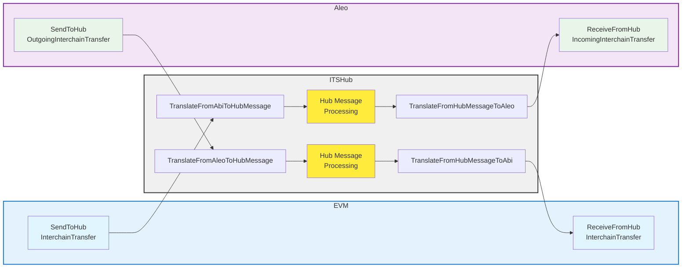

# Aleo ITS-Hub and Axelar ITS-Hub message translation

# ITS HubMessage

ITS HubMesage defines 3 messages.

1. `SendToHub`
1. `ReceiveFromHub`
1. `RgisterTokenMetadata`

`SendToHub` and `ReceiveFromHub` define a direction for the message, they contain an ITS Message and the destination or the origin chain respectively.

# ITS Message

| Axelar ITS-Hub        | Direction | Aleo ITS-Hub                    |
| --------------------- | :-------: | ------------------------------- |
| InterchainTransfer    |    ->     | IncomingInterchainTransfer      |
| InterchainTransfer    |    <-     | OutgoingInterchainTransfer      |
| DeployInterchainToken |    ->     | FromRemoteDeployInterchainToken |
| DeployInterchainToken |    <-     | DeployInterchainToken           |
| LinkToken             |    <->    | TBD                             |

->: ReceiveFromHub
<-: SendToHub

# Aleo ITS Messages

| Axelar ITS-Hub                        | Aleo ITS-Hub                                                     |
| ------------------------------------- | ---------------------------------------------------------------- |
| SendToHub(InterchainTransfer)         | ItsIncomingInterchainTransfer                                    |
| ReceiveFromHub(InterchainTransfer)    | ItsOutgoingInterchainTransfer                                    |
| SendToHub(DeployInterchainToken)      | RemoteDeployInterchainToken(DeployInterchainToken)               |
| ReceiveFromHub(DeployInterchainToken) | ItsMessageDeployInterchainToken(FromRemoteDeployInterchainToken) |
| RgisterTokenMetadata                  | TBD                                                              |

| Check list | Rust impl                                                                 | Axelar ITS-Hub        | Direction | Aleo ITS-Hub                    |
| :--------: | :------------------------------------------------------------------------ | --------------------- | :-------: | ------------------------------- |
|    [ ]     | `impl TryFrom<InterchainTransfer> for IncomingInterchainTransfer`         | InterchainTransfer    |    ->     | IncomingInterchainTransfer      |
|    [ ]     | `impl TryFrom<OutgoingInterchainTransfer> for InterchainTransfer`         | InterchainTransfer    |    <-     | OutgoingInterchainTransfer      |
|    [ ]     | `impl TryFrom<DeployInterchainToken> for FromRemoteDeployInterchainToken` | DeployInterchainToken |    ->     | FromRemoteDeployInterchainToken |
|    [ ]     | `impl TryFrom<Aleo::DeployInterchainToken> for DeployInterchainToken`     | DeployInterchainToken |    <-     | DeployInterchainToken           |

